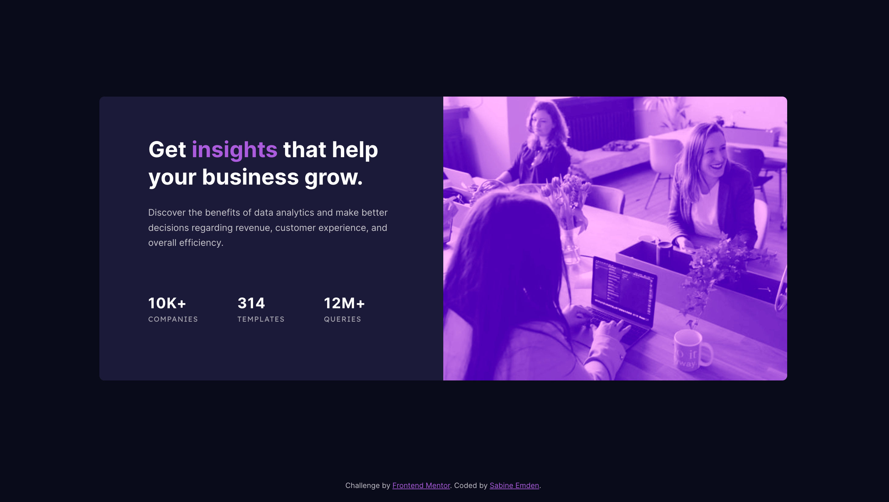

# Frontend Mentor - Stats preview card component solution

This is a solution to the [Stats preview card component challenge on Frontend Mentor](https://www.frontendmentor.io/challenges/stats-preview-card-component-8JqbgoU62). Frontend Mentor challenges help me improve my coding skills by building realistic projects.

## Table of contents

- [Overview](#overview)
  - [The challenge](#the-challenge)
  - [Screenshot](#screenshot)
  - [Links](#links)
- [My process](#my-process)
  - [Built with](#built-with)
  - [What I learned](#what-i-learned)
  - [Continued development](#continued-development)
  - [Useful resources](#useful-resources)
- [Author](#author)
- [Acknowledgments](#acknowledgments)

## Overview

### The challenge

The brief for this challenge was to build out the stats preview card component and get it looking as close to the design as possible, starting with the following assets:

- Figma design file for mobile, tablet, and desktop layouts
- JPEG design files for mobile and desktop layouts
- Style guide for fonts, colors, etc.
- Optimized image assets
- HTML file with pre-written content

Users should be able to:

- View the optimal layout depending on their device's screen size

### Screenshot



### Links

- Solution URL: [Frontend Mentor solution](https://your-solution-url.com)
- [Live site](https://sabineemden.github.io/fm-stats-preview-card-component/)

## My process

### Built with

- Semantic HTML5 markup
- CSS custom properties
- Flexbox
- CSS Grid
- Mobile-first workflow

### What I learned

I tried a number of possible solutions for the image and its purple overlay. The image is decorative, and the mobile design uses a different image file than the tablet and desktop designs.

I could have used a background-image directly on the `<div class="image-wrapper">` and swapped the image in the media query for the breakpoint at `36rem` screen width. I opted for the `<picture>` element instead. I don't see the image as a background image because there is no other content on top of it.

A `srcset` directly on the `` element would have been another option. The `<picture>` element forces the browser to update the value of the `src` attribute in the `` element at the breakpoint. The `srcset` on the `` element would have given only a suggestion to the browser.

```html
<div class="image-wrapper">
  <picture>
    <source
      media="(min-width: 36rem)"
      srcset="./images/image-header-desktop.jpg" />
    </picture>
</div>
```

For the purple tint on the black and white image, I first had a purple overlay with reduced opacity that used the `::before` pseudo selector on top of the image. Then I came across CSS blend modes. Blending the overlay with the image with `mix-blend-mode` gives the image a look that is closer to the design.

I simplified the code by removing the `::before` pseudo selector, adding a purple background color to the `<div>` that wraps the `<picture>` element, and using `mix-blend-mode` on the `` element.

I tested a couple of values for `mix-blend-mode`. I chose `overlay` to get the image looking as close to the design as possible.

```css
.image-wrapper {
  background-color: var(--purple500);
}

.card-image {
  object-fit: cover;
  width: 100%;
  mix-blend-mode: overlay;
}
```

### Continued development

This was my first project where I used the `<picture>` element. I now have a much better understanding of responsive images and can use that in future projects. I also learned a lot about different ways to add a color overlay to an image.

### Useful resources

- [The picture element](https://web.dev/learn/design/picture-element) on web.dev - This article helped me to better understand the `<picture>` element.
- [Blend Modes](https://css-tricks.com/basics-css-blend-modes/) by Chris Coyier for CSS Tricks - I learned from this article I could use `mix-blend-mode` to blend the image with the purple background of its wrapper.

## Author

I'm an aspiring web developer and a former chemist. What I bring from chemistry to software development is a systematic approach to problem solving and the perseverance to not give up easily.

- Frontend Mentor - [SabineEmden](https://www.frontendmentor.io/profile/SabineEmden)
- Personal Website - [Sabine Emden](https://www.sabineemden.com/)
- Mastodon - [@sabineemden](https://social.tchncs.de/@sabineemden)

## Acknowledgments

This project uses Josh Comeau's [CSS Reset](https://www.joshwcomeau.com/css/custom-css-reset/).

The font families in this project are [Inter](https://fonts.google.com/specimen/Inter) and [Lexend Deca](https://fonts.google.com/specimen/Lexend+Deca). The fonts are licensed under the [Open Font License](https://openfontlicense.org/open-font-license-official-text/).
